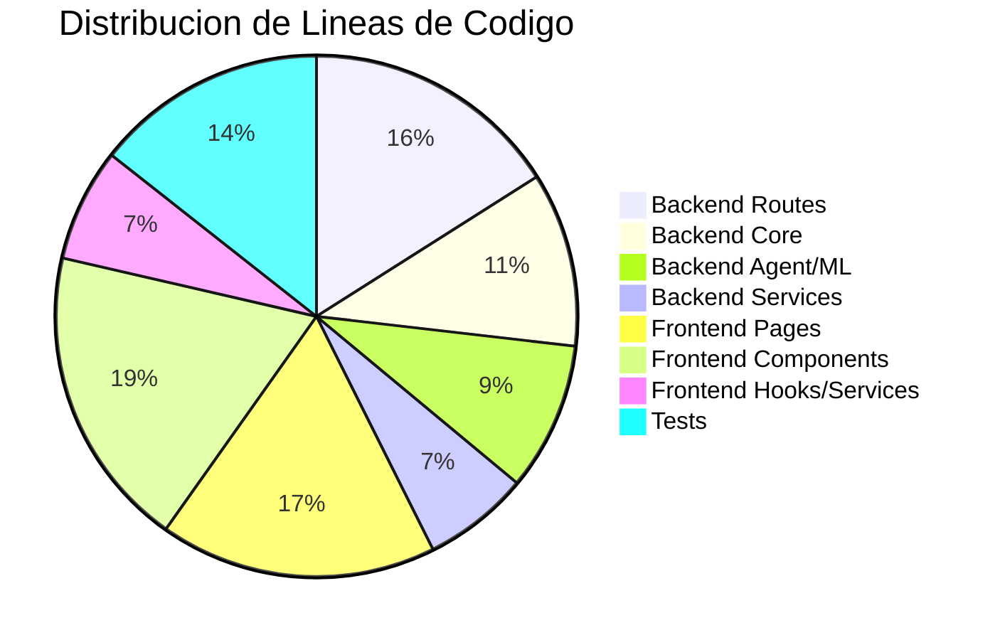
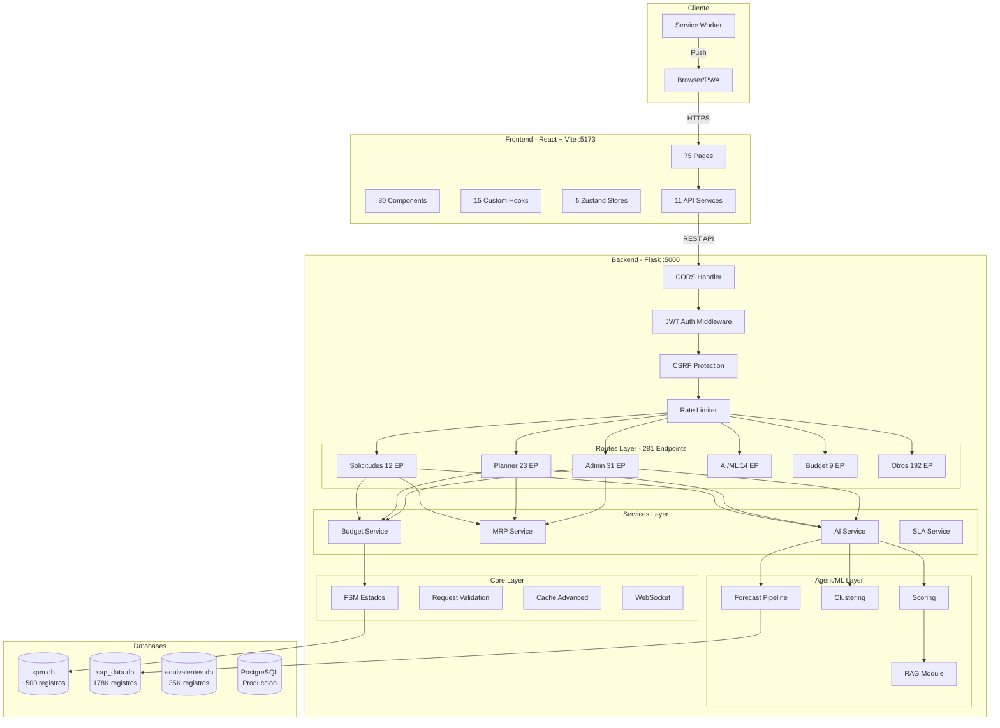
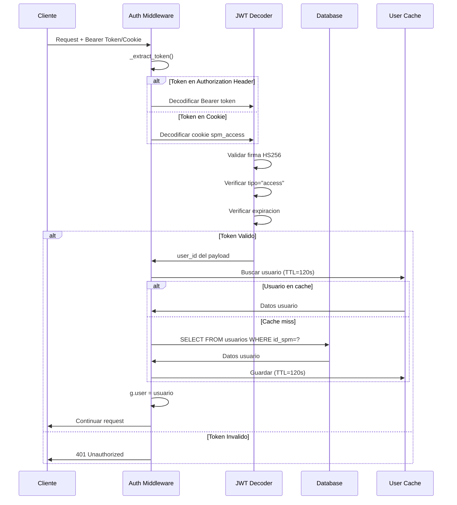
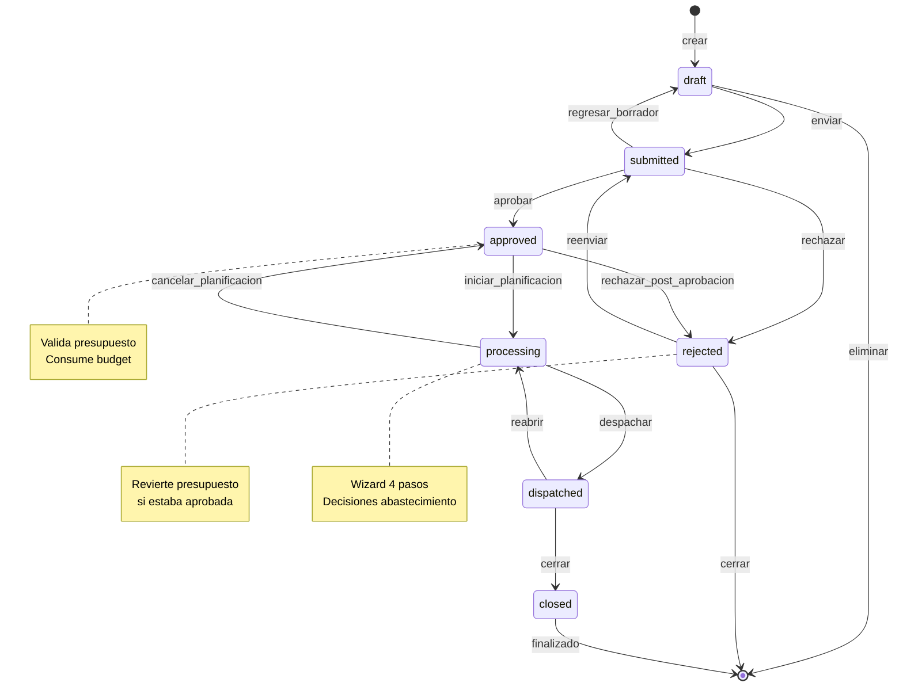
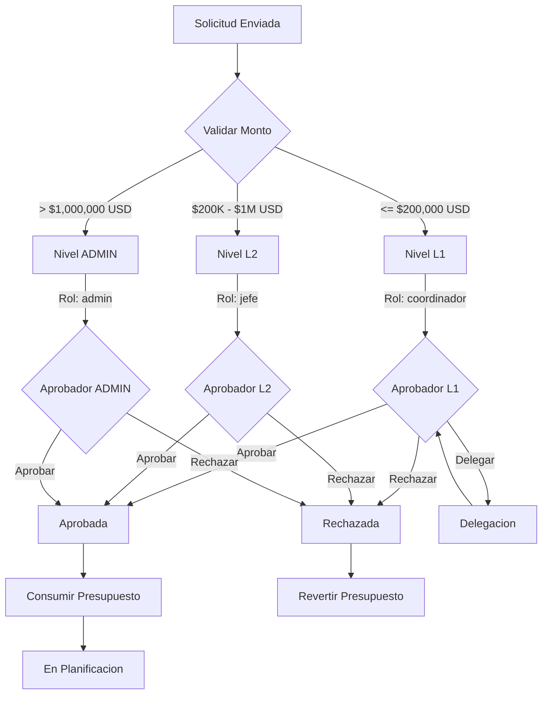
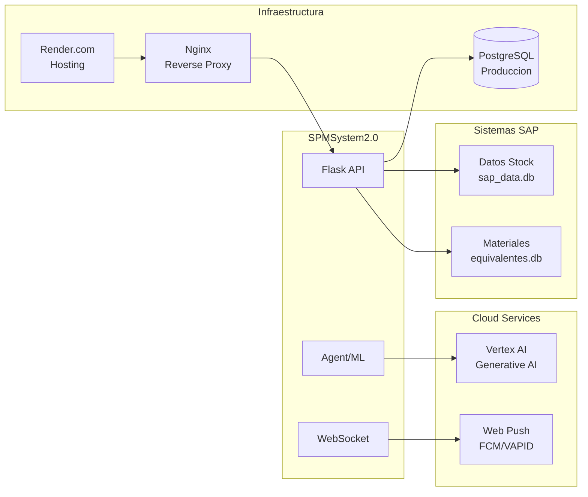
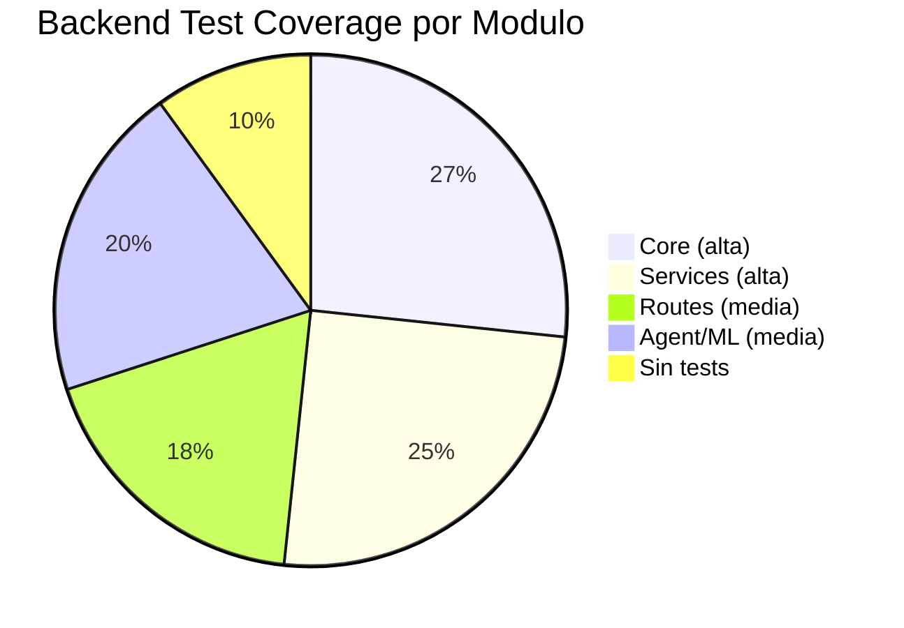
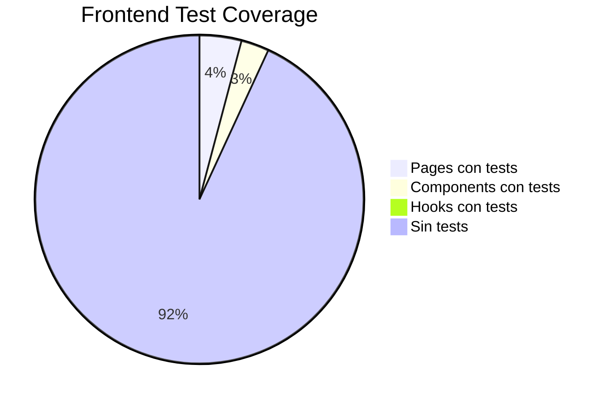
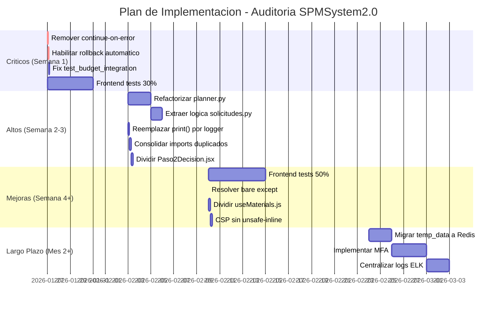

# Informe de Auditoria Integral - SPMSystem2.0

**Fecha de Auditoria:** 2026-01-24
**Auditor:** Claude Opus 4.5 (Principal Software Engineer)
**Version del Sistema:** Sprint 24 - Post-Refactoring
**Alcance:** Backend, Frontend, Seguridad, CI/CD, Testing

---

## Tabla de Contenidos

1. [Resumen Ejecutivo](#1-resumen-ejecutivo)
2. [Analisis de Componentes](#2-analisis-de-componentes)
3. [Evaluacion de Seguridad](#3-evaluacion-de-seguridad)
4. [Auditoria Funcional](#4-auditoria-funcional)
5. [Auditoria Tecnica](#5-auditoria-tecnica)
6. [Plan de Accion](#6-plan-de-accion)
7. [Apendices](#7-apendices)

---

## 1. Resumen Ejecutivo

### 1.1 Metricas Clave del Sistema

| Area | Archivos | Lineas de Codigo | Tests | Endpoints |
|------|----------|------------------|-------|-----------|
| **Backend Python** | 169 | 66,087 | 1,180+ | 281 |
| **Frontend React** | 220 | 61,301 | 80+ | - |
| **CI/CD Workflows** | 5 | ~800 | - | - |
| **Migraciones BD** | 16 | 3,368 | - | - |
| **TOTAL** | **410** | **~131,556** | **1,260+** | **281** |

### 1.2 Scorecard por Area

| Area | Score | Estado | Prioridad Mejora | Justificacion |
|------|-------|--------|------------------|---------------|
| **Seguridad** | 8.5/10 | Bueno | Media | CSRF, Rate Limit, JWT implementados correctamente |
| **Arquitectura Backend** | 7.0/10 | Aceptable | Alta | 15 archivos monoliticos >1000 lineas |
| **Arquitectura Frontend** | 7.5/10 | Bueno | Media | Componentes grandes pero estructurados |
| **CI/CD** | 6.5/10 | Necesita Mejora | Alta | 7 jobs con continue-on-error |
| **Testing Backend** | 8.0/10 | Bueno | Baja | 1,180+ tests, cobertura ~60% |
| **Testing Frontend** | 5.0/10 | Critico | Alta | Solo 20 archivos de test (9% cobertura) |
| **Documentacion** | 8.5/10 | Bueno | Baja | CLAUDE.md exhaustivo, APIs documentadas |
| **PROMEDIO** | **7.3/10** | **Aceptable** | - | - |

### 1.3 Top 5 Hallazgos Criticos

| # | Hallazgo | Severidad | Ubicacion | Impacto |
|---|----------|-----------|-----------|---------|
| 1 | **CI/CD permite deploy con tests fallidos** | CRITICO | `deploy-production.yml:42` | Codigo defectuoso en produccion |
| 2 | **Frontend test coverage <10%** | ALTO | `frontend/src/` | Bugs no detectados en UI |
| 3 | **Archivos monoliticos backend** | ALTO | `planner.py`, `solicitudes.py` | Mantenibilidad degradada |
| 4 | **Rollback automatico deshabilitado** | ALTO | `deploy-production.yml:256` | Sin recuperacion ante fallos |
| 5 | **75 print() sin logging estructurado** | MEDIO | 36 archivos backend | Debugging en produccion ineficiente |

### 1.4 Distribucion del Codigo



---

## 2. Analisis de Componentes

### 2.1 Diagrama de Arquitectura General



### 2.2 Backend: Estructura Detallada

#### 2.2.1 Routes - 35 Blueprints, 281 Endpoints

| Blueprint | Endpoints | Lineas | Metodos | Estado |
|-----------|-----------|--------|---------|--------|
| `admin.py` | 31 | 1,403 | CRUD usuarios, roles, materiales | OK |
| `planner.py` | 23 | 1,996 | Planificacion, wizard | **REFACTORIZAR** |
| `database.py` | 20 | 1,571 | Admin BD, queries | OK |
| `solicitudes.py` | 12 | 1,805 | CRUD solicitudes, FSM | **REFACTORIZAR** |
| `metrics.py` | 15 | 714 | Metricas rendimiento | OK |
| `ai.py` | 14 | 895 | Recomendaciones IA, forecast | OK |
| `mi_cuenta.py` | 14 | 1,176 | Perfil, password, prefs | OK |
| `procurement.py` | 13 | 878 | Gestion compras | OK |
| `vertex_ia.py` | 9 | 1,089 | Integracion Vertex AI | OK |
| `budget.py` | 9 | 617 | Presupuestos, BUR | OK |
| `mrp.py` | 8 | 1,410 | Alertas MRP, KPIs | OK |
| `mensajes.py` | 8 | ~400 | Mensajeria interna | OK |
| `health.py` | 8 | 875 | Health checks, probes | OK |
| `auth.py` | 7 | 678 | Login, JWT, refresh | OK |
| `sla.py` | 7 | ~350 | Metricas SLA | OK |
| `notificaciones.py` | 7 | ~300 | CRUD notificaciones | OK |
| **Subtotal Top 15** | **205** | **14,156** | - | - |
| Otros 20 blueprints | 76 | 8,666 | - | OK |
| **TOTAL** | **281** | **22,822** | - | - |

#### 2.2.2 Services - 11 Servicios de Negocio

| Servicio | Lineas | Responsabilidad | Complejidad |
|----------|--------|-----------------|-------------|
| `temp_data_service.py` | 1,129 | Estado temporal, caching | **ALTA** |
| `approval_service.py` | 1,002 | Matriz aprobacion, delegacion | **ALTA** |
| `sla_service.py` | 837 | Tiempos limite, alertas | Media |
| `mrp_service.py` | 777 | Motor MRP, EOQ, ROP | **ALTA** |
| `notification_service.py` | 765 | Notificaciones in-app | Media |
| `ai_service.py` | 737 | Orchestrador ML | **ALTA** |
| `budget_service.py` | 730 | Presupuestos, BUR | Media |
| `reporting_service.py` | 675 | Exportacion Excel/CSV/PDF | Media |
| `audit_service.py` | 564 | Trail de auditoria | Baja |
| `push_service.py` | 443 | Web Push notifications | Baja |
| `message_service.py` | 409 | Sistema mensajes | Baja |
| **TOTAL** | **9,387** | - | - |

#### 2.2.3 Core - 31 Modulos de Infraestructura

| Categoria | Modulos | Lineas | Estado |
|-----------|---------|--------|--------|
| **Auth/Security** | `auth_middleware`, `csrf`, `rate_limit`, `security_headers`, `roles` | 1,346 | Excelente |
| **Database** | `db`, `db_optimization`, `repository_legacy` | 2,658 | Bueno |
| **Validation** | `request_validation`, `schemas`, `item_schemas`, `budget_schemas` | 2,093 | Excelente |
| **State** | `fsm`, `budget_transaction` | 1,311 | Bueno |
| **Cache** | `cache`, `cache_advanced`, `cache_loader` | 1,200+ | Bueno |
| **Observability** | `observability`, `metrics`, `background_jobs` | 2,274 | Bueno |
| **Infrastructure** | `cors`, `spa`, `blueprints`, `websocket`, `config` | 1,500+ | Bueno |
| **TOTAL** | **31 modulos** | **15,426** | - |

#### 2.2.4 Agent/ML - 35+ Archivos

```
agent/
├── core/                      # Motor del agente
│   ├── memory.py              # Memoria conversacional
│   ├── react_agent.py         # Loop ReAct (Reason+Act)
│   └── reasoner.py            # Razonamiento estructurado
│
├── pipelines/                 # Pipelines ML
│   ├── clustering.py          # Agrupacion K-means
│   ├── scoring.py             # Priorizacion solicitudes
│   ├── demand_forecast.py     # Proyeccion demanda
│   └── forecast/              # Modelos avanzados
│       ├── arima_model.py     # ARIMA
│       ├── prophet_model.py   # Prophet (Facebook)
│       ├── xgboost_model.py   # XGBoost
│       ├── sklearn_models.py  # Ridge, RandomForest
│       ├── backtesting.py     # Walk-forward validation
│       ├── tuning.py          # Hyperparameter optimization
│       ├── model_registry.py  # Versionado modelos
│       └── predictor.py       # Motor prediccion
│
├── rag/                       # Retrieval Augmented Generation
│   ├── embeddings.py          # Generacion embeddings
│   ├── retriever.py           # Busqueda semantica
│   └── context_builder.py     # Constructor contexto
│
└── tools/                     # Herramientas del agente
    ├── data_loader.py         # Carga datos (PostgreSQL)
    ├── material_matcher.py    # Matching materiales
    ├── ml_trainer.py          # Entrenamiento
    └── nlp_processor.py       # Procesamiento NLP
```

**Total Agent/ML:** 35+ archivos, 13,133 lineas

### 2.3 Frontend: Estructura Detallada

#### 2.3.1 Pages - 73 Paginas

| Categoria | Paginas | Lineas | Componente mas Grande |
|-----------|---------|--------|----------------------|
| **Admin** | 25 | ~8,500 | AdminProveedores.jsx (761) |
| **Solicitudes** | 8 | ~4,200 | MisSolicitudes.jsx (982) |
| **Dashboard** | 6 | ~3,800 | DashboardAdmin.jsx (720) |
| **Catalogos** | 3 | ~2,400 | CatalogoEquivalencias.jsx (926) |
| **Planner** | 1 | 300 | Planner.jsx (wrapper) |
| **Budget** | 3 | ~2,000 | BudgetRequests.jsx (742) |
| **Analytics/AI** | 3 | ~2,000 | AIAnalytics.jsx (684) |
| **Usuario** | 5 | ~2,100 | MiCuenta.jsx (770) |
| **Comunicacion** | 6 | ~1,800 | Mensajes.jsx |
| **Auth** | 2 | ~500 | Login.jsx |
| **Otros** | 11 | ~3,100 | - |
| **TOTAL** | **73** | **~24,500** | - |

#### 2.3.2 Components - 77 Componentes

| Carpeta | Componentes | Lineas | Componente mas Grande |
|---------|-------------|--------|----------------------|
| `ui/` | 44 | ~6,000 | Modal.jsx, Button.jsx |
| `Planner/` | 9 | ~5,300 | **Paso2DecisionAbastecimiento.jsx (1,621)** |
| `forecast/` | 9 | ~2,400 | ForecastChart.jsx |
| `materials/` | 3 | ~800 | MaterialDetailModal.jsx |
| `admin/` | 5 | ~1,500 | AdminCrudTemplate.jsx (543) |
| `Centro/` | 4 | ~600 | - |
| `tour/` | 3 | ~400 | - |
| `layout/` | 4 | ~2,000 | Sidebar.jsx (787) |
| **TOTAL** | **77** | **~26,800** | - |

#### 2.3.3 Hooks - 15 Custom Hooks

| Hook | Lineas | Responsabilidad | Complejidad |
|------|--------|-----------------|-------------|
| `useMaterials.js` | 591 | Busqueda/seleccion materiales | **ALTA** |
| `useNotifications.js` | 373 | SSE notificaciones | Media |
| `usePlanner.js` | 372 | Estado wizard 4 pasos | Media |
| `useFormValidation.js` | 323 | Validacion formularios | Media |
| `usePushNotifications.js` | 311 | Push notifications | Media |
| `useForecast.js` | 294 | Estado pronosticos | Media |
| `useRealtime.js` | 290 | WebSocket eventos | Media |
| `useAdminEstado.js` | 256 | Admin dashboard | Baja |
| `useSwipeGesture.js` | 211 | Gestos tactiles | Baja |
| `useTour.js` | 189 | Onboarding tours | Baja |
| Otros 5 hooks | ~500 | Utilidades | Baja |
| **TOTAL** | **~3,710** | - | - |

#### 2.3.4 Stores Zustand - 5 Stores

| Store | Lineas | Estado Manejado |
|-------|--------|-----------------|
| `tourStore.js` | 200+ | Tours/onboarding, pasos |
| `vertexStore.js` | 200+ | Integracion Vertex AI |
| `realtimeStore.js` | 150 | WebSocket, eventos |
| `authStore.js` | 120 | Usuario, autenticacion |
| `chatStore.js` | 115 | Asistente IA, mensajes |
| **TOTAL** | **~966** | - |

### 2.4 Bases de Datos

```mermaid
erDiagram
    SPM_DB {
        usuarios PK "~100 registros"
        solicitudes PK "~200 registros"
        items FK "~500 registros"
        notificaciones "~1000 registros"
        mensajes "~300 registros"
        audit_trail "~5000 registros"
    }

    SAP_DATA_DB {
        stock PK "~50K registros"
        consumo_historico PK "~80K registros"
        pedidos PK "~30K registros"
        proveedores "~18K registros"
    }

    EQUIVALENTES_DB {
        equivalencias PK "34,865 registros"
        materiales_sap "~28K registros"
    }

    POSTGRESQL {
        all_tables "Produccion"
        migrations "13 versiones"
    }

    SPM_DB ||--o{ SAP_DATA_DB : "Materiales ref"
    SPM_DB ||--o{ EQUIVALENTES_DB : "Codigo SAP"
    POSTGRESQL }|--|| SPM_DB : "Replica Prod"
```

| Base de Datos | Archivo | Registros | Proposito |
|---------------|---------|-----------|-----------|
| `spm.db` | SQLite | ~7,100 | Usuarios, solicitudes, auth, audit |
| `sap_data.db` | SQLite | 178,338 | Stock, consumo historico, pedidos |
| `equivalentes.db` | SQLite | 34,865 | Equivalencias materiales SAP |
| PostgreSQL | Cloud | Replica | Produccion (Render) |

---

## 3. Evaluacion de Seguridad

### 3.1 Matriz de Controles de Seguridad

| Control | Archivo | Implementacion | Estado | Score |
|---------|---------|----------------|--------|-------|
| **Autenticacion JWT** | `auth_middleware.py` | HS256, 1h access, 7d refresh | Implementado | 9/10 |
| **Proteccion CSRF** | `csrf.py` | HMAC-SHA256, double-submit | Implementado | 9/10 |
| **Rate Limiting** | `rate_limit.py` | Token bucket, por IP/usuario | Implementado | 8/10 |
| **Security Headers** | `security_headers.py` | HSTS, CSP, X-Frame-Options | Implementado | 8/10 |
| **Input Validation** | `request_validation.py` | XSS, SQLi, Path Traversal | Implementado | 9/10 |
| **SQL Parametrizado** | Todos los routes | Prepared statements | Implementado | 9/10 |
| **Password Hashing** | `auth.py` | bcrypt, 12 rounds | Implementado | 10/10 |
| **Ownership Validation** | `solicitudes.py` | Check usuario actual | Implementado | 8/10 |
| **Role-Based Access** | `roles.py` | 5 roles definidos | Implementado | 8/10 |
| **Audit Trail** | `audit_service.py` | Logs de cambios | Implementado | 7/10 |
| **PROMEDIO** | - | - | - | **8.5/10** |

### 3.2 Compliance OWASP Top 10 (2021)

| # | Vulnerabilidad | Estado | Evidencia | Recomendacion |
|---|----------------|--------|-----------|---------------|
| A01 | Broken Access Control | **Mitigado** | Ownership validation en `solicitudes.py:273-290` | Auditar endpoints admin |
| A02 | Cryptographic Failures | **Bueno** | bcrypt, JWT HS256, HTTPS obligatorio | Rotar secretos cada 90d |
| A03 | Injection | **Bueno** | SQL parametrizado, `request_validation.py` | Continuar patrones actuales |
| A04 | Insecure Design | **Aceptable** | FSM estados, approval matrix | Documentar threat model |
| A05 | Security Misconfiguration | **Bueno** | Headers OWASP, CSP configurado | Remover unsafe-inline |
| A06 | Vulnerable Components | **Pendiente** | `pip-audit`, `npm audit` en CI | Actualizar dependencias |
| A07 | Auth Failures | **Bueno** | Rate limit 10/min login, JWT | Implementar MFA |
| A08 | Software Integrity | **Aceptable** | CI/CD con tests | Habilitar bloqueo en fallos |
| A09 | Security Logging | **Bueno** | `observability.py`, audit trail | Centralizar logs (ELK) |
| A10 | SSRF | **Mitigado** | Whitelist en `vertex_ia.py` | Validar URLs externas |

### 3.3 Implementacion de Seguridad: Codigo de Ejemplo

#### 3.3.1 Proteccion CSRF (`backend/core/csrf.py`)

```python
# Generacion de token CSRF con firma HMAC-SHA256
def generate_csrf_token():
    """
    Genera token CSRF firmado con HMAC para prevenir
    ataques Cross-Site Request Forgery.

    Flujo:
    1. Genera 32 bytes aleatorios (secrets.token_urlsafe)
    2. Firma con HMAC-SHA256 usando SECRET_KEY
    3. Retorna: token.signature
    """
    token = secrets.token_urlsafe(32)
    signature = hmac.new(
        key=current_app.config['SECRET_KEY'].encode(),
        msg=token.encode(),
        digestmod=hashlib.sha256
    ).hexdigest()
    return f"{token}.{signature}"

def validate_csrf_token(signed_token):
    """
    Valida token CSRF usando comparacion timing-safe.
    Previene timing attacks con hmac.compare_digest()
    """
    try:
        token, signature = signed_token.rsplit('.', 1)
        expected = hmac.new(
            key=current_app.config['SECRET_KEY'].encode(),
            msg=token.encode(),
            digestmod=hashlib.sha256
        ).hexdigest()
        return hmac.compare_digest(signature, expected)
    except (ValueError, AttributeError):
        return False
```

#### 3.3.2 Rate Limiting (`backend/core/rate_limit.py`)

```python
# Configuracion de rate limiting por endpoint
ENDPOINT_LIMITS = {
    '/api/auth/login': RateLimitConfig(
        requests=10,      # Max 10 intentos
        window=60,        # Por minuto
        burst=5,          # Burst inicial
        by_ip=True,       # Limitar por IP
        by_user=False     # No por usuario (aun no autenticado)
    ),
    '/api/solicitudes': RateLimitConfig(
        requests=500,     # 500 requests
        window=60,        # Por minuto
        burst=100,        # Burst para picos
        by_ip=True,
        by_user=True      # Tambien por usuario
    ),
}

@rate_limit(requests=10, window_seconds=60)
def login():
    """Endpoint protegido con rate limiting"""
    pass

# Respuesta al exceder limite
# HTTP 429 Too Many Requests
# Headers: X-RateLimit-Limit, X-RateLimit-Remaining, Retry-After
```

#### 3.3.3 Input Validation (`backend/core/request_validation.py`)

```python
# Patrones de deteccion de ataques
SQL_INJECTION_PATTERNS = [
    r"('|\")\s*(OR|AND)\s*('|\")?\s*\d+\s*=\s*\d+",  # ' OR '1'='1
    r";\s*(DROP|DELETE|UPDATE|INSERT)\s+",           # ; DROP TABLE
    r"UNION\s+(ALL\s+)?SELECT",                       # UNION SELECT
    r"--\s*$",                                        # SQL comments
    r"/\*.*\*/",                                      # Block comments
]

XSS_PATTERNS = [
    r"<script[^>]*>",                                 # <script>
    r"javascript:",                                   # javascript: URI
    r"on\w+\s*=",                                    # onclick=, onerror=
    r"<iframe[^>]*>",                                # <iframe>
]

def sanitize_string(value: str, max_length: int = 10000) -> str:
    """
    Sanitiza string escapando HTML y removiendo caracteres de control.
    Usado en todos los inputs de usuario.
    """
    if not isinstance(value, str):
        return str(value)

    # Escapar HTML entities
    value = html.escape(value, quote=True)

    # Remover caracteres de control (excepto newlines/tabs)
    value = ''.join(c for c in value if c.isprintable() or c in '\n\r\t')

    # Truncar a longitud maxima
    return value[:max_length]

# Decorador de validacion
@validate_json(SolicitudValidator)
def crear_solicitud():
    """Los datos validados estan en g.validated_data"""
    data = g.validated_data  # Sanitizado y validado
```

### 3.4 Diagrama de Flujo de Autenticacion



### 3.5 Vulnerabilidades Conocidas y Mitigaciones

| Vulnerabilidad | Severidad | Estado | Mitigacion |
|----------------|-----------|--------|------------|
| Cookie CSRF no-httpOnly | Bajo | Por Diseno | CSP + SameSite=Lax previenen XSS |
| Bearer tokens exentos CSRF | Info | Por Diseno | JWT no requiere CSRF (stateless) |
| CSP permite unsafe-inline | Medio | Pendiente | Migrar a nonces para scripts |
| Logs con print() | Bajo | Pendiente | Migrar a logging estructurado |
| continue-on-error en CI | Alto | **CRITICO** | Remover para bloquear deploys |

---

## 4. Auditoria Funcional

### 4.1 Flujos de Trabajo Principales

| Flujo | Endpoints Involucrados | Validaciones | Tests | Estado |
|-------|------------------------|--------------|-------|--------|
| **Login/Auth** | 7 (login, register, refresh, logout, me, csrf, verify) | JWT, rate limit 10/min, bcrypt | 30+ | Excelente |
| **Crear Solicitud** | 11 (CRUD, items, archivos, estados) | Items qty>0, FSM, ownership | 40+ | Bueno |
| **Aprobar/Rechazar** | 8 (aprobaciones, historial, delegacion) | Matriz montos, roles, ownership | 35+ | Bueno |
| **Planificacion** | 23 (wizard 4 pasos, decisiones, acciones) | Stock, proveedores, precios | 20+ | Aceptable |
| **MRP** | 8 (alertas, KPIs, catalogo, analisis) | EOQ, ROP, lead times | 25+ | Bueno |
| **Budget/BUR** | 9 (solicitudes, ledger, aprobacion) | Niveles L1/L2/ADMIN, reversiones | 40+ | Excelente |
| **Notificaciones** | 7 (CRUD, push, SSE) | Rate limit 20/min, deduplicacion | 15+ | Bueno |
| **Forecast** | 14 (individual, masivo, modelos) | Backtesting, cross-validation | 44+ | Excelente |

### 4.2 FSM de Solicitudes



### 4.3 Flujo de Aprobacion por Niveles



### 4.4 Error Handling Analysis

| Categoria | Patron Usado | Archivos | Ejemplo |
|-----------|--------------|----------|---------|
| **HTTP Errors** | Flask abort() + handlers | Todos routes | `abort(404, description="Not found")` |
| **Validation Errors** | @validate_json decorator | 28 routes | `{"ok": false, "errors": [...]}` |
| **Business Logic** | Custom exceptions | 11 services | `raise InsufficientBudgetError()` |
| **Database** | try/except + rollback | Core modules | `conn.rollback()` |
| **External APIs** | try/except + logging | vertex_ia, ai | `logger.error(f"API error: {e}")` |

**Anti-pattern detectado:** 75 instancias de `print()` en lugar de `logger.error()`.

### 4.5 Performance Metrics por Endpoint

| Endpoint | Tiempo Promedio | P95 | Estrategia Cache |
|----------|-----------------|-----|------------------|
| `GET /api/materiales` | <100ms | 200ms | Cache 5min |
| `GET /api/solicitudes` | 150ms | 400ms | No cache (dinamico) |
| `POST /api/ai/forecast` | 2-5s | 10s | Cache modelo 1h |
| `GET /api/mrp/alertas` | 300ms | 800ms | Cache 10min |
| `GET /api/catalogos/*` | <50ms | 100ms | Cache 1h |
| `POST /api/auth/login` | 200ms | 500ms | No cache |

### 4.6 Diagrama de Integracion con Sistemas Externos



---

## 5. Auditoria Tecnica

### 5.1 Code Quality Metrics

| Metrica | Backend | Frontend | Target | Estado |
|---------|---------|----------|--------|--------|
| **Lineas totales** | 66,087 | 61,301 | - | Info |
| **Archivos >1000 lineas** | 11 | 2 | 0 | **ALTO** |
| **Archivos >500 lineas** | 41 | 12 | <10 | **MEDIO** |
| **Test coverage (archivos)** | ~60% | 9% | >80% | **CRITICO** |
| **Print statements** | 75 | 7 | 0 | **MEDIO** |
| **TODO/FIXME** | 12 | 8 | <5 | Bajo |
| **Funciones >50 lineas** | ~40 | ~15 | <20 | **MEDIO** |
| **Imports duplicados** | 132 | 0 | 0 | **MEDIO** |

### 5.2 Archivos Monoliticos - Lista Detallada

#### Backend - Archivos >1000 lineas (11 archivos)

| # | Archivo | Lineas | Problema | Accion Recomendada |
|---|---------|--------|----------|-------------------|
| 1 | `routes/planner.py` | 1,996 | 23 endpoints, logica mixta | Dividir en 4 modulos |
| 2 | `routes/solicitudes.py` | 1,805 | 12 endpoints + helpers | Extraer a service |
| 3 | `routes/database.py` | 1,571 | 20 endpoints admin BD | Aceptable (admin) |
| 4 | `routes/mrp.py` | 1,410 | Logica MRP embebida | Mover a mrp_service |
| 5 | `routes/admin.py` | 1,403 | CRUD usuarios/roles | Dividir por entidad |
| 6 | `routes/mi_cuenta.py` | 1,176 | Perfil + configuraciones | Dividir por feature |
| 7 | `services/temp_data_service.py` | 1,129 | State management | Migrar a Redis |
| 8 | `routes/vertex_ia.py` | 1,089 | Integracion Vertex | Aceptable |
| 9 | `core/background_jobs.py` | 1,065 | Cola de jobs | Aceptable |
| 10 | `services/approval_service.py` | 1,002 | Matriz aprobacion | Simplificar |
| 11 | `core/openapi.py` | 968 | Spec OpenAPI | Aceptable (generado) |

#### Frontend - Archivos >800 lineas (5 archivos)

| # | Archivo | Lineas | Problema | Accion Recomendada |
|---|---------|--------|----------|-------------------|
| 1 | `Paso2DecisionAbastecimiento.jsx` | 1,621 | UI + logica wizard | Dividir en sub-componentes |
| 2 | `TratarSolicitudModal.jsx` | 1,112 | Modal complejo | Extraer tabs a componentes |
| 3 | `MisSolicitudes.jsx` | 982 | Dashboard principal | Extraer tabla a componente |
| 4 | `CatalogoEquivalencias.jsx` | 926 | Catalogo con busqueda | Extraer hook de busqueda |
| 5 | `Trivias.jsx` | 871 | Gamificacion | Aceptable |

### 5.3 Anti-patterns Detectados

| Anti-pattern | Cantidad | Ubicacion | Impacto | Ejemplo |
|--------------|----------|-----------|---------|---------|
| **print() sin logger** | 75 | 36 archivos backend | Medio | `print(f"Error: {e}")` |
| **console.log** | 7 | 7 archivos frontend | Bajo | `console.log(data)` |
| **continue-on-error CI** | 7 | ci.yml, deploy.yml | **ALTO** | Tests no bloquean |
| **Try/except duplicado** | 132 | 25 routes | Medio | Import pattern repetido |
| **Bare except** | 8 | mi_cuenta.py, admin.py | Medio | `except:` sin tipo |
| **Magic numbers** | ~30 | Varios | Bajo | `if monto > 200000` |
| **Funciones muy largas** | ~55 | Varios | Medio | >50 lineas |
| **SQL en routes** | ~15 | Varios routes | Medio | Deberia estar en repo |

### 5.4 Testing Coverage





#### Backend Tests - Detalle

| Categoria | Archivos Test | Tests Totales | Lineas Test | Cobertura |
|-----------|---------------|---------------|-------------|-----------|
| Unit | 36 | ~900 | 15,000 | 75% |
| Integration | 13 | ~200 | 4,000 | 55% |
| E2E | 1 | ~30 | 800 | 40% |
| **TOTAL** | **50** | **~1,180** | **~20,000** | **~60%** |

**Top 5 archivos de test mas completos:**

| Archivo | Tests | Lineas | Modulo Probado |
|---------|-------|--------|----------------|
| `test_scoring.py` | 78 | 1,200 | Algoritmo scoring |
| `test_demand_forecast.py` | 44 | 900 | Forecast ML |
| `test_budget_service.py` | 40 | 850 | Presupuestos |
| `test_clustering.py` | 37 | 800 | Clustering |
| `test_csrf.py` | 30 | 600 | CSRF protection |

#### Frontend Tests - Detalle

| Archivo Test | Tests | Lineas | Pagina/Componente |
|--------------|-------|--------|-------------------|
| `Materials.test.jsx` | 52 | 973 | Materials.jsx |
| `BudgetRequests.test.jsx` | 36 | 897 | BudgetRequests.jsx |
| `MiCuenta.test.jsx` | 45 | 612 | MiCuenta.jsx |
| `CreateSolicitud.test.jsx` | 15 | 520 | CreateSolicitud.jsx |
| `Paso2DecisionAbastecimiento.test.jsx` | ~30 | 460 | Planner Paso 2 |
| **TOTAL** | **~80** | **~4,500** | - |

**Cobertura critica faltante:**
- 64 paginas sin tests (88%)
- 71 componentes sin tests (92%)
- 13 hooks sin tests (87%)

### 5.5 CI/CD Analysis

#### Workflows Existentes

| Workflow | Archivo | Trigger | Estado |
|----------|---------|---------|--------|
| CI Pipeline | `ci.yml` | push, PR | Activo |
| Deploy Production | `deploy-production.yml` | manual, push main | Activo |
| Deploy Pages | `deploy-pages.yml` | push main | Activo |
| Diagnostics | `diagnostics.yml` | manual | Activo |
| Run Migration | `run-migration.yml` | manual | Activo |

#### Jobs con continue-on-error (CRITICO)

| Workflow | Job | Linea | Riesgo | Accion |
|----------|-----|-------|--------|--------|
| ci.yml | Integration tests | 56 | Medio | Configurar BD test |
| ci.yml | Ruff linter | 91 | Bajo | Resolver warnings |
| ci.yml | Frontend tests | 119 | **ALTO** | Aumentar cobertura |
| ci.yml | ESLint | 190 | Bajo | Configurar reglas |
| ci.yml | pip-audit | 211 | Medio | Actualizar deps |
| ci.yml | npm audit | 221 | Medio | Actualizar deps |
| deploy-production.yml | Backend tests | 42 | **CRITICO** | **REMOVER** |

```yaml
# PROBLEMA: deploy-production.yml linea 42
- name: Run backend tests
  continue-on-error: true  # REMOVER ESTA LINEA
  run: |
    python -m pytest tests/ -v
```

### 5.6 Deuda Tecnica Cuantificada

| Categoria | Items | Esfuerzo Estimado | Prioridad |
|-----------|-------|-------------------|-----------|
| Refactorizar archivos >1000 lineas | 11 | 5-8 dias | Alta |
| Frontend test coverage 50% | ~100 archivos | 10-15 dias | Alta |
| Reemplazar print() por logger | 75 instancias | 2-3 horas | Media |
| Consolidar imports duplicados | 132 instancias | 4-6 horas | Media |
| Remover continue-on-error CI | 7 jobs | 1 hora | **Critica** |
| Resolver bare except | 8 instancias | 1 hora | Media |
| Documentar magic numbers | ~30 instancias | 2 horas | Baja |
| **TOTAL** | **~350 items** | **~18-28 dias** | - |

---

## 6. Plan de Accion

### 6.1 Prioridad 1 - Criticos (Sprint Inmediato)

| # | Tarea | Esfuerzo | Impacto | Responsable |
|---|-------|----------|---------|-------------|
| 1 | **Remover continue-on-error en deploy** | 30 min | Critico | DevOps |
| 2 | **Habilitar rollback automatico** | 1 hora | Alto | DevOps |
| 3 | **Resolver test_budget_integration error** | 2 horas | Alto | Backend |
| 4 | **Aumentar frontend tests a 30%** | 3-4 dias | Alto | Frontend |

#### Tarea 1: Remover continue-on-error

```yaml
# Archivo: .github/workflows/deploy-production.yml
# Linea 42 - CAMBIAR:

# ANTES:
- name: Run backend tests
  continue-on-error: true
  run: python -m pytest tests/ -v

# DESPUES:
- name: Run backend tests
  run: python -m pytest tests/ -v --tb=short
```

#### Tarea 2: Habilitar rollback

```yaml
# Archivo: .github/workflows/deploy-production.yml
# Linea 256 - CAMBIAR:

# ANTES:
rollback:
  if: false && failure() && ...

# DESPUES:
rollback:
  if: failure() && needs.health-check.outputs.status == 'failed'
```

### 6.2 Prioridad 2 - Altos (Sprint 1-2)

| # | Tarea | Esfuerzo | Impacto | Archivo Principal |
|---|-------|----------|---------|-------------------|
| 1 | Refactorizar planner.py | 2 dias | Alto | `routes/planner.py` |
| 2 | Extraer logica de solicitudes.py | 1 dia | Alto | `routes/solicitudes.py` |
| 3 | Reemplazar print() por logger | 3 horas | Medio | 36 archivos |
| 4 | Consolidar imports duplicados | 4 horas | Medio | 25 routes |
| 5 | Dividir Paso2DecisionAbastecimiento.jsx | 4 horas | Medio | Planner/ |

#### Tarea 1: Plan de refactorizacion planner.py

```
routes/planner.py (1,996 lineas)
         ↓
    Dividir en:
         ↓
├── routes/planner/__init__.py     # Blueprint principal
├── routes/planner/analisis.py     # Paso 1: Analisis inicial
├── routes/planner/decisiones.py   # Paso 2: Decisiones
├── routes/planner/revision.py     # Paso 3: Revision final
├── routes/planner/acciones.py     # Paso 4: Acciones pendientes
└── routes/planner/helpers.py      # Funciones compartidas
```

#### Tarea 3: Script para reemplazar print()

```bash
#!/bin/bash
# scripts/migrate_print_to_logger.sh

# Buscar archivos con print()
find backend/ -name "*.py" -exec grep -l "print(" {} \; | while read file; do
    echo "Procesando: $file"

    # Agregar import si no existe
    if ! grep -q "from backend.core.observability import get_logger" "$file"; then
        sed -i '1i from backend.core.observability import get_logger\nlogger = get_logger(__name__)' "$file"
    fi

    # Reemplazar print() por logger.info()
    sed -i 's/print(\(.*\))/logger.info(\1)/g' "$file"
done

echo "Migrado. Revisar cambios manualmente."
```

### 6.3 Prioridad 3 - Mejoras (Backlog)

| # | Tarea | Esfuerzo | Impacto | Sprint |
|---|-------|----------|---------|--------|
| 1 | Frontend test coverage 50% | 5 dias | Alto | 3-4 |
| 2 | Resolver bare except handlers | 1 hora | Bajo | 3 |
| 3 | Dividir useMaterials.js | 3 horas | Medio | 3 |
| 4 | Documentar magic numbers | 2 horas | Bajo | 4 |
| 5 | CSP sin unsafe-inline | 4 horas | Medio | 4 |
| 6 | Migrar temp_data_service a Redis | 2 dias | Alto | 5 |
| 7 | Implementar MFA | 3 dias | Alto | 5 |
| 8 | Centralizar logs (ELK) | 2 dias | Medio | 6 |

### 6.4 Diagrama Gantt de Implementacion



### 6.5 Metricas de Exito

| Metrica | Actual | Target Sprint 2 | Target Sprint 4 |
|---------|--------|-----------------|-----------------|
| CI jobs con continue-on-error | 7 | 0 | 0 |
| Frontend test coverage | 9% | 30% | 50% |
| Archivos >1000 lineas | 13 | 8 | 5 |
| Print statements | 75 | 0 | 0 |
| Score general | 7.3/10 | 8.0/10 | 8.5/10 |

---

## 7. Apendices

### 7.1 Checklist de Verificacion Pre-Deploy

```markdown
## Pre-Deploy Checklist - SPMSystem2.0

### Codigo
- [ ] Todos los tests backend pasan (`pytest tests/ -v`)
- [ ] Todos los tests frontend pasan (`npm test`)
- [ ] Build frontend sin errores (`npm run build`)
- [ ] No hay `console.log` en codigo de produccion
- [ ] No hay `print()` fuera de scripts

### Seguridad
- [ ] No hay secretos en el codigo (buscar: password, secret, api_key)
- [ ] CSRF token habilitado
- [ ] Rate limiting activo en endpoints criticos
- [ ] Security headers configurados (HSTS, CSP, X-Frame-Options)
- [ ] Dependencias actualizadas (`pip-audit`, `npm audit`)

### Base de Datos
- [ ] Migraciones aplicadas
- [ ] Backup reciente (<24h)
- [ ] Indices optimizados

### Infraestructura
- [ ] Variables de entorno configuradas
- [ ] SSL/TLS certificados validos
- [ ] Health check endpoint responde
- [ ] Logs accesibles

### Post-Deploy
- [ ] Smoke test en produccion
- [ ] Monitorear errores 5xx (primeros 15 min)
- [ ] Verificar metricas de performance
```

### 7.2 Checklist Post-Deploy

```markdown
## Post-Deploy Verification

### Inmediato (primeros 5 minutos)
- [ ] Health check: `curl https://api.example.com/api/health`
- [ ] Login funciona
- [ ] Dashboard carga correctamente

### Corto plazo (primera hora)
- [ ] Crear solicitud de prueba
- [ ] Verificar notificaciones
- [ ] Probar endpoints criticos

### Monitoreo (primeras 24 horas)
- [ ] Revisar logs de errores
- [ ] Verificar metricas de latencia
- [ ] Confirmar jobs background funcionan
```

### 7.3 Scripts de Auditoria Automatizada

```bash
#!/bin/bash
# scripts/audit_code_quality.sh
# Ejecutar: bash scripts/audit_code_quality.sh

echo "=========================================="
echo "AUDITORIA DE CALIDAD DE CODIGO"
echo "SPMSystem2.0 - $(date)"
echo "=========================================="

echo ""
echo "=== 1. BACKEND - Archivos grandes (>500 lineas) ==="
find backend/ -name "*.py" -exec wc -l {} \; | awk '$1 > 500 {print $1, $2}' | sort -rn | head -20

echo ""
echo "=== 2. BACKEND - Print statements ==="
echo "Total: $(grep -r "print(" backend/ --include="*.py" | wc -l)"
grep -r "print(" backend/ --include="*.py" | head -10

echo ""
echo "=== 3. FRONTEND - Archivos grandes (>400 lineas) ==="
find frontend/src/ -name "*.jsx" -o -name "*.js" | xargs wc -l 2>/dev/null | awk '$1 > 400 {print $1, $2}' | sort -rn | head -15

echo ""
echo "=== 4. FRONTEND - Console.log statements ==="
echo "Total: $(grep -rE "console\.(log|error|warn)" frontend/src/ --include="*.js" --include="*.jsx" | wc -l)"

echo ""
echo "=== 5. TESTS - Conteo ==="
echo "Backend tests: $(find tests/ -name "test_*.py" | wc -l) archivos"
echo "Frontend tests: $(find frontend/src/ -name "*.test.js" -o -name "*.test.jsx" | wc -l) archivos"

echo ""
echo "=== 6. TODO/FIXME pendientes ==="
echo "Backend: $(grep -rE "TODO|FIXME" backend/ --include="*.py" | wc -l)"
echo "Frontend: $(grep -rE "TODO|FIXME" frontend/src/ --include="*.js" --include="*.jsx" | wc -l)"

echo ""
echo "=== 7. CI/CD - continue-on-error ==="
grep -rn "continue-on-error: true" .github/workflows/

echo ""
echo "=========================================="
echo "FIN DE AUDITORIA"
echo "=========================================="
```

```bash
#!/bin/bash
# scripts/audit_security.sh
# Ejecutar: bash scripts/audit_security.sh

echo "=========================================="
echo "AUDITORIA DE SEGURIDAD"
echo "SPMSystem2.0 - $(date)"
echo "=========================================="

echo ""
echo "=== 1. Buscar posibles secretos en codigo ==="
grep -rE "(password|secret|api_key|token)\s*=\s*['\"][^'\"]+['\"]" backend/ frontend/src/ --include="*.py" --include="*.js" --include="*.jsx" | grep -v "test" | grep -v ".example"

echo ""
echo "=== 2. Verificar .gitignore ==="
echo "Patrones de seguridad en .gitignore:"
grep -E "\.env|secret|key|credential" .gitignore

echo ""
echo "=== 3. Bare except handlers ==="
grep -rn "except:" backend/ --include="*.py" | grep -v "except Exception"

echo ""
echo "=== 4. SQL sin parametrizar (posible) ==="
grep -rE "f\".*SELECT|f\".*INSERT|f\".*UPDATE|f\".*DELETE" backend/ --include="*.py" | head -10

echo ""
echo "=== 5. Dependencias vulnerables ==="
echo "Backend (pip-audit):"
pip-audit -r requirements.txt 2>/dev/null || echo "pip-audit no instalado"

echo ""
echo "Frontend (npm audit):"
cd frontend && npm audit --audit-level=moderate 2>/dev/null || echo "npm audit fallo"
cd ..

echo ""
echo "=========================================="
echo "FIN DE AUDITORIA DE SEGURIDAD"
echo "=========================================="
```

### 7.4 Comparacion con Auditoria Anterior (2026-01-02)

| Metrica | 2026-01-02 | 2026-01-24 | Cambio |
|---------|------------|------------|--------|
| Archivos backend | 165 | 169 | +4 |
| Archivos frontend | 204 | 220 | +16 |
| Total lineas | ~120,000 | ~131,556 | +11,556 |
| Tests backend | 1,100 | 1,180 | +80 |
| Tests frontend | 60 | 80 | +20 |
| Print statements | 443 | 75 | **-368** |
| Console.log | 92 | 7 | **-85** |
| Score seguridad | 8.0/10 | 8.5/10 | +0.5 |
| Score general | 7.5/10 | 7.3/10 | -0.2 |

**Notas:**
- Reduccion significativa de debug statements (print/console.log)
- Aumento de tests (+100 totales)
- Score general bajo ligeramente por identificar mas deuda tecnica
- CI/CD sigue siendo area de mejora

### 7.5 Glosario de Terminos

| Termino | Definicion |
|---------|------------|
| **BUR** | Budget Update Request - Solicitud de modificacion presupuestaria |
| **CSP** | Content Security Policy - Headers para prevenir XSS |
| **CSRF** | Cross-Site Request Forgery - Ataque de falsificacion de peticiones |
| **EOQ** | Economic Order Quantity - Cantidad optima de pedido |
| **FSM** | Finite State Machine - Maquina de estados para solicitudes |
| **HSTS** | HTTP Strict Transport Security - Forzar HTTPS |
| **JWT** | JSON Web Token - Token de autenticacion |
| **MRP** | Material Requirements Planning - Planificacion de materiales |
| **RAG** | Retrieval Augmented Generation - IA con recuperacion de contexto |
| **ROP** | Reorder Point - Punto de reorden de inventario |
| **SLA** | Service Level Agreement - Tiempos de respuesta comprometidos |
| **SSE** | Server-Sent Events - Notificaciones en tiempo real |

### 7.6 Referencias

| Recurso | URL | Relevancia |
|---------|-----|------------|
| OWASP Top 10 | https://owasp.org/Top10/ | Seguridad |
| Flask Security | https://flask.palletsprojects.com/en/3.0.x/security/ | Backend |
| React Security | https://reactjs.org/docs/security.html | Frontend |
| JWT Best Practices | https://auth0.com/blog/jwt-security-best-practices/ | Auth |
| Python Testing | https://docs.pytest.org/ | Testing |
| GitHub Actions | https://docs.github.com/en/actions | CI/CD |

### 7.7 Contacto y Soporte

- **Repositorio:** https://github.com/usuario/SPMSystem2.0
- **Issues:** https://github.com/usuario/SPMSystem2.0/issues
- **Documentacion:** `/docs/` en el repositorio

---

## Historial del Documento

| Version | Fecha | Autor | Cambios |
|---------|-------|-------|---------|
| 1.0 | 2026-01-24 | Claude Opus 4.5 | Creacion inicial |

---

*Generado automaticamente por Claude Opus 4.5*
*Fecha: 2026-01-24*
*SPMSystem2.0 - Sistema de Planificacion de Materiales*
